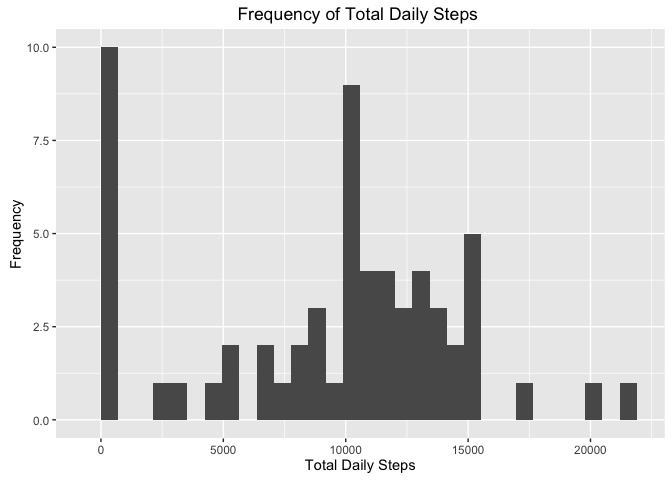
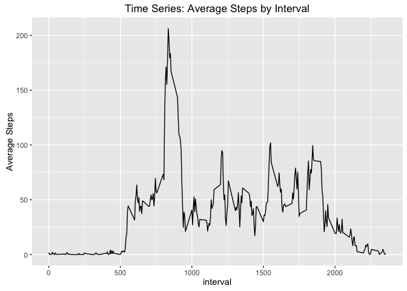
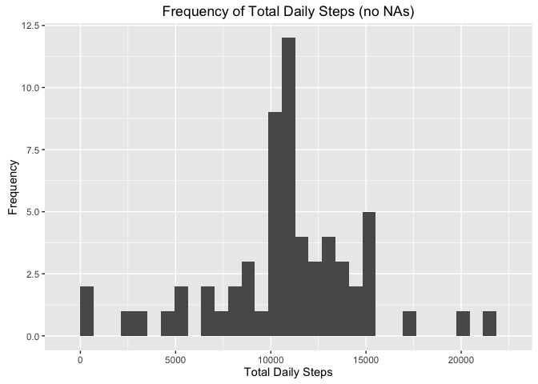
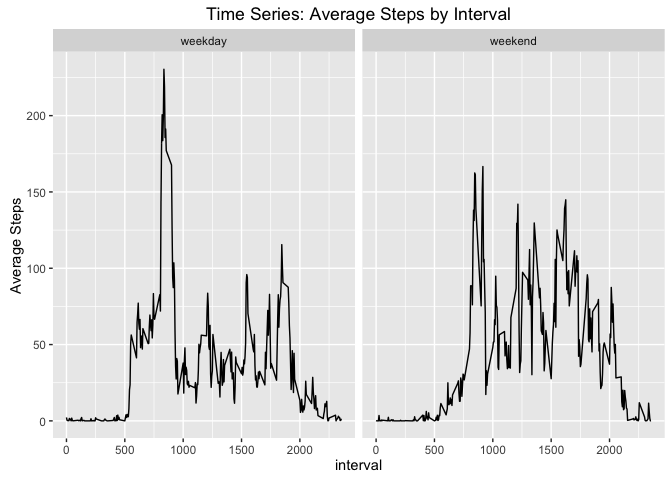

# Reproducible Research: Peer Assessment 1


## Loading and preprocessing the data
The zip file activity.zip must be in your home directory. After reading in the file, use the dplyr package to group the dataframe by date and calculate the sum of steps for each day:


```r
library(dplyr)
```

```
## 
## Attaching package: 'dplyr'
```

```
## The following objects are masked from 'package:stats':
## 
##     filter, lag
```

```
## The following objects are masked from 'package:base':
## 
##     intersect, setdiff, setequal, union
```

```r
unzip("activity.zip")
df <- read.csv("activity.csv", stringsAsFactors = FALSE)
dft <- df %>%
  group_by(date) %>%
  summarise(total = sum(steps, na.rm = TRUE))
dft
```

```
## Source: local data frame [61 x 2]
## 
##          date total
##         (chr) (int)
## 1  2012-10-01     0
## 2  2012-10-02   126
## 3  2012-10-03 11352
## 4  2012-10-04 12116
## 5  2012-10-05 13294
## 6  2012-10-06 15420
## 7  2012-10-07 11015
## 8  2012-10-08     0
## 9  2012-10-09 12811
## 10 2012-10-10  9900
## ..        ...   ...
```

Here is a histogram showing the frequency of each daily total:


```r
library(ggplot2)
ggplot(dft, aes(total)) +
  geom_histogram() +
  labs(title = "Frequency of Total Daily Steps ",
       x = "Total Daily Steps",
       y = "Frequency")
```

```
## `stat_bin()` using `bins = 30`. Pick better value with `binwidth`.
```



## What is mean and median total number of steps taken per day?

The mean total number of steps taken per day is:


```r
mean(dft$total, na.rm = TRUE) # mean
```

```
## [1] 9354.23
```

The median total number of steps taken per day is:

```r
median(dft$total, na.rm = TRUE) # median
```

```
## [1] 10395
```

## What is the average daily activity pattern?

This is a time series plot of the average steps taken across all days of each time interval:


```r
dfa <- df %>%
  group_by(interval) %>%
  summarise(avg_steps = mean(steps, na.rm = TRUE))
ggplot(dfa, aes(interval, avg_steps)) +
  geom_line() +
  labs(title = "Time Series: Average Steps by Interval",
       y = "Average Steps")
```



The interval that had the highest number of average steps was:


```r
dfa$interval[dfa$avg_steps == max(dfa$avg_steps)]
```

```
## [1] 835
```

## Imputing missing values

Here are the number of missing values for the steps, date, and interval variables respectively:


```r
nrow(df[is.na(df$steps) == TRUE, ])
```

```
## [1] 2304
```

```r
nrow(df[is.na(df$date) == TRUE, ])
```

```
## [1] 0
```

```r
nrow(df[is.na(df$interval) == TRUE, ])
```

```
## [1] 0
```

I imputed the average steps for a given interval where NAs were found in the steps column. The resulting dataset is called "merged":


```r
merged <- merge(df, dfa, by.x = "interval", by.y = "interval") # merge
nas <- which(is.na(merged$steps)) # Indices of steps na values
merged$steps[nas] <- merged$avg_steps[nas] # Impute avg steps for interval
```

Now there are no longer NAs in the steps column:


```r
nrow(merged[is.na(merged$steps) == TRUE, ]) # Are there any NAs?
```

```
## [1] 0
```

Here is a histogram showing the frequency of each daily total, now with imputed values. While the original histogram (with NAs) showed that 0 steps was the most frequently occuring value, the new histogram (with imputed values for NAs) shows that a value just over 10000 steps is now the most frequently occuring:


```r
# New dataframe that sums the total steps
dft2 <- merged %>%
  group_by(date) %>%
  summarise(total = sum(steps, na.rm = TRUE))

library(ggplot2)
ggplot(dft2, aes(total)) +
  geom_histogram() +
  labs(title = "Frequency of Total Daily Steps (no NAs)",
       x = "Total Daily Steps",
       y = "Frequency")
```

```
## `stat_bin()` using `bins = 30`. Pick better value with `binwidth`.
```



With the new imputed values, the mean and median total steps taken each day are now equal.

New mean:

```r
mean(dft2$total) # mean
```

```
## [1] 10766.19
```

New median:

```r
median(dft2$total) # median
```

```
## [1] 10766.19
```

## Are there differences in activity patterns between weekdays and weekends?

Here are weekday and weekend time series panels comparing the average steps per interval. The highest average for weekdays is between 500 and 1000, while the highest average for weekends is much closer to 1000:


```r
merged$date <- as.Date(merged$date, format = "%Y-%m-%d")
merged <- mutate(merged, day = weekdays(date, abbreviate = TRUE))
wday <- c("Mon", "Tue", "Wed", "Thu", "Fri")
wend <- c("Sat", "Sun")
merged$day_type[merged$day %in% wday ] <- "weekday"
merged$day_type[merged$day %in% wend] <- "weekend"

dfa2 <- merged %>%
  group_by(interval, day_type) %>%
  summarise(avg_int_steps = mean(steps))

# Plot
ggplot(dfa2, aes(interval, avg_int_steps)) +
  geom_line() +
  facet_wrap(~day_type) +
  labs(title = "Time Series: Average Steps by Interval",
       y = "Average Steps")
```


